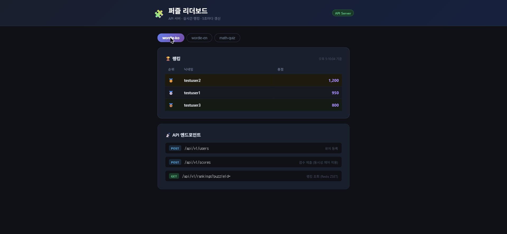
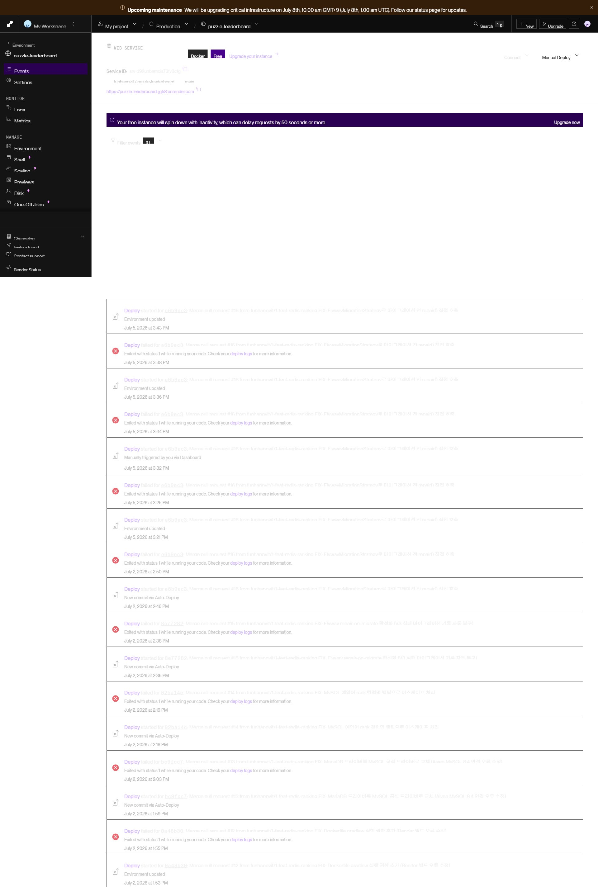

# 🧩 Puzzle Leaderboard

> 실시간 퍼즐 게임 점수 집계 및 랭킹 API 서버  
> **동시성 제어 · Redis 캐싱 · 분산 환경 배포** 역량을 증명하기 위한 포트폴리오 프로젝트

---

## 📌 프로젝트 목적

엔터프라이즈 백엔드 개발 경험(Java/Spring Boot, 배치, ORM)은 탄탄하지만  
**동시성 제어 · 캐싱 전략 · 클라우드 네이티브 배포** 경험이 부족한 점을 보완하기 위해 제작.

단순 CRUD가 아닌, **JMeter 부하 테스트로 race condition을 수치로 증명**하고  
Redis 분산락 적용 전/후 TPS 비교를 통해 문제 해결 과정을 기록한다.

---

## 🛠 기술 스택

| 분류 | 기술 |
|------|------|
| Language | Java 21 |
| Framework | Spring Boot 3.4.3 |
| DB | MySQL (Aiven) |
| Cache / Ranking | Redis (Upstash) — Sorted Set |
| 동시성 제어 | Redisson 분산락 |
| 마이그레이션 | Flyway |
| 부하 테스트 | JMeter |
| 인프라 | Render (Spring Boot), Aiven (MySQL), Upstash (Redis) |
| IaC | Terraform (AWS ECS 코드 작성 — 참고용) |
| CI/CD | GitHub Actions |
| Frontend | React 18 + TypeScript + Vite → Vercel |

---

## 🏗 아키텍처

```
[React Dashboard : Vercel]
  └── GET /api/v1/rankings  ─── 5초 폴링 ──▶ 실시간 랭킹 표시
         │ API 호출
         ▼
[Render - Spring Boot : 8080]  ←── GitHub push 시 자동 배포
  ├── POST /api/v1/scores   ─── Redisson 분산락 ──▶ Redis ZSET (ZINCRBY)
  │                                                         │
  │                                                    MySQL 영속화
  └── GET  /api/v1/rankings ─── Redis ZREVRANGE (O(log N))
         │                               │
         ▼                               ▼
  [Aiven - MySQL]              [Upstash - Redis]
```

---

## 📂 프로젝트 구조

```
puzzle-leaderboard/
├── src/main/java/com/example/leaderboard/
│   ├── domain/
│   │   ├── user/          # 유저 CRUD
│   │   ├── score/         # 점수 제출 (동시성 제어)
│   │   └── ranking/       # 랭킹 조회 (Redis ZSET)
│   ├── batch/             # 일별 랭킹 스냅샷 배치 (자정 실행)
│   ├── config/            # Redis, Redisson 설정
│   └── common/            # 공통 응답, 예외 처리
├── src/main/resources/
│   ├── application.yml
│   ├── application-local.yml
│   └── db/migration/      # Flyway SQL
├── frontend/              # React 랭킹 대시보드
├── jmeter/                # 부하 테스트 시나리오 (.jmx)
├── terraform/             # AWS 인프라 코드
├── docker-compose.yml     # 로컬 MariaDB + Redis
└── .github/workflows/     # CI/CD
```

---

## 🗄 ERD

```
users
├── id (PK)
├── username (UQ)
├── email (UQ)
├── password_hash
├── status (ACTIVE / INACTIVE / BANNED)
└── created_at / updated_at

puzzle_scores
├── id (PK)
├── user_id (FK → users)
├── puzzle_id
├── score
├── elapsed_sec   ← 풀이 소요 시간
├── is_valid      ← Rate Limit 위반 시 false
└── submitted_at

daily_ranking_snapshots         ← 배치가 자정에 Redis → MariaDB 영속화
├── id (PK)
├── user_id (FK → users)
├── snapshot_date
├── puzzle_id
├── rank
└── total_score
```

---

## 📡 API

| Method | Path | 설명 |
|--------|------|------|
| `POST` | `/api/v1/users` | 유저 등록 |
| `GET` | `/api/v1/users/{id}` | 유저 조회 |
| `POST` | `/api/v1/scores` | 점수 제출 (Redisson 분산락) |
| `GET` | `/api/v1/rankings?puzzleId=` | 랭킹 조회 (Redis ZSET) |

### 점수 제출 요청 예시
```json
POST /api/v1/scores
{
  "userId": 1,
  "puzzleId": "wordle-ko",
  "score": 350,
  "elapsedSec": 42
}
```

### Rate Limiting
- Redis `INCR` + `EXPIRE` 기반 슬라이딩 윈도우
- 동일 유저, 10초 내 3회 초과 제출 시 `is_valid: false` 로 기록 (집계 제외)

---

## 🚀 로컬 실행

### 사전 요구사항
- JDK 21+
- Docker Desktop

### 1. 인프라 실행
```bash
docker compose up -d
# MariaDB: localhost:3307
# Redis:   localhost:6379
```

### 2. 백엔드 실행
```bash
./gradlew bootRun --args='--spring.profiles.active=local'
# http://localhost:8081
```

### 3. 프론트엔드 실행
```bash
cd frontend
npm install
npm run dev
# http://localhost:5173
```

---

## ⚡ 성능 비교 (JMeter 부하 테스트)

> 3주차 완료 후 업데이트 예정

**시나리오**: 100 스레드 × 10회 = 1,000건 동시 점수 제출 (로컬 환경 기준)

| 케이스 | TPS | 평균 응답시간 | 90% Line | 99% Line | 오류율 |
|--------|:---:|:----------:|:--------:|:--------:|:-----:|
| 케이스1 - 락 없음 (DB only) | **740.7/sec** | 31ms | 55ms | 67ms | 0% |
| 케이스2 - Redis ZINCRBY (원자연산) | **816.3/sec** | 25ms | 39ms | 51ms | 0% |
| 케이스3 - Redisson 분산락 | **286.9/sec** | 232ms | 414ms | 573ms | 0% |

**분석**
- 케이스1 → 케이스2: Redis ZINCRBY 원자연산으로 **TPS 10% 향상**, 응답시간 단축
- 케이스2 → 케이스3: Redisson 분산락은 직렬화로 인해 **TPS 65% 감소**, 응답시간 약 9배 증가
- 분산락은 성능보다 **정확성(Race Condition 방지)** 이 목적 — 오류율 0% 유지하며 데이터 정합성 보장

---

## 📅 개발 로드맵

- [x] **1주차** — 기본 CRUD + DB 스키마 + 로컬 환경 구성
- [x] **2주차** — Redis ZSET 랭킹 + Redisson 분산락 + Redis Rate Limiting + Java 전환
- [x] **3주차** — JMeter 부하 테스트 + 성능 비교 수치 기록 ([#4](https://github.com/funhappyit/puzzle-leaderboard/issues/4))
- [x] **4주차** — AWS ECS Fargate + Terraform + GitHub Actions CI/CD 코드 작성 ([#7](https://github.com/funhappyit/puzzle-leaderboard/issues/7))
- [x] **배포** — Render + Aiven(MySQL) + Upstash(Redis) 무료 클라우드 실배포 ([#9](https://github.com/funhappyit/puzzle-leaderboard/issues/9))

---

## 🖼 배포 스크린샷

### 프론트엔드 — 퍼즐 리더보드 대시보드 (Vercel)



### 백엔드 — Render 배포 이벤트



---

## 🔗 관련 링크

- [GitHub Issues](https://github.com/funhappyit/puzzle-leaderboard/issues)
- [Frontend Dashboard](https://puzzle-leaderboard-five.vercel.app)
- [Backend API](https://puzzle-leaderboard-jg58.onrender.com)
